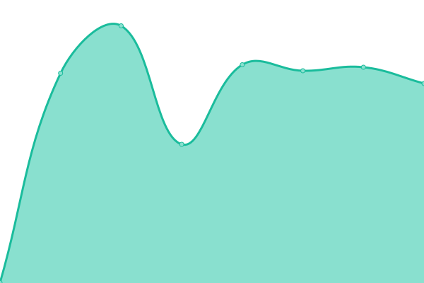

# [📈 Live Status](https://status.pletos.gg): <!--live status--> **🟩 All systems operational**

This repository contains the open-source uptime monitor and status page for [Upptime](https://upptime.js.org), powered by [Upptime](https://github.com/upptime/upptime).

With [Upptime](https://upptime.js.org), you can get your own unlimited and free uptime monitor and status page, powered entirely by a GitHub repository. We use [Issues](https://github.com/upptime/upptime/issues) as incident reports, [Actions](https://github.com/pletos-esports/pletos-uptime/actions) as uptime monitors, and [Pages](https://status.pletos.gg) for the status page.

<!--start: status pages-->
<!-- This summary is generated by Upptime (https://github.com/upptime/upptime) -->
<!-- Do not edit this manually, your changes will be overwritten -->
<!-- prettier-ignore -->
| URL | Status | History | Response Time | Uptime |
| --- | ------ | ------- | ------------- | ------ |
|  [Pletos API](https://api.pletos.gg/status) | 🟩 Up | [pletos-api.yml](https://github.com/pletos-esports/pletos-uptime/commits/HEAD/history/pletos-api.yml) | 

 532ms
     
 | 

<a href="https://status.pletos.gg/history/pletos-api">100.00%</a>
    

|  [Pletos Website](https://www.pletos.gg) | 🟩 Up | [pletos-website.yml](https://github.com/pletos-esports/pletos-uptime/commits/HEAD/history/pletos-website.yml) | 

 870ms
     
 | 

<a href="https://status.pletos.gg/history/pletos-website">100.00%</a>
    

|  [Pletos Partners](https://partners.pletos.gg) | 🟩 Up | [pletos-partners.yml](https://github.com/pletos-esports/pletos-uptime/commits/HEAD/history/pletos-partners.yml) | 

 680ms
     
 | 

<a href="https://status.pletos.gg/history/pletos-partners">100.00%</a>
    

<!--end: status pages-->

[**Visit our status website →**](https://status.pletos.gg)

## 📄 License

- Powered by: [Upptime](https://github.com/upptime/upptime)
- Code: [MIT](./LICENSE) © [Upptime](https://upptime.js.org)
- Data in the `./history` directory: [Open Database License](https://opendatacommons.org/licenses/odbl/1-0/)
